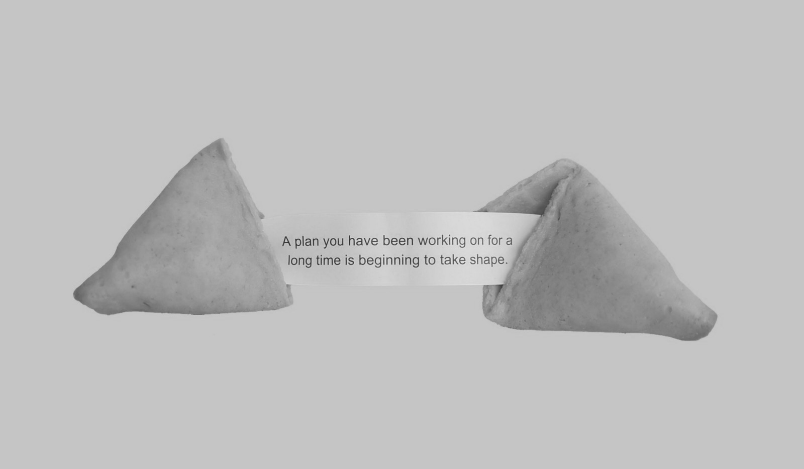

# Starting is hard / Hello World

*Fortune Cookie (Source: https://unsplash.com/photos/GUYCM0jhuSA)*

Starting is always the hardest. Putting out that first blog post, first line of code or software release isn't easy. In fact, before writing this post, I got lost in quite a "google session" on what to write for the first blog post. Many opinions, many ideas but none were really helpful. Instead reading about how important and critical that first blog post is, was rather intimidating. Instead I will just align on the tried and true 5W's that feel familiar.

----

## About the author ( $ whoami )
Before diving in about what I plan with this blog, let me introduce myself briefly. I have had the opportunity to experience great challenges, mentors and access to good knowledge - some of that being amazing bloggers. Without the plethora of knowledge freely available I would not be where I am today. I currently dabble a lot in the deep sea of DevOps, Legacy Migrations and Distributed Systems work-wise and sometimes during my spare time. If you want to connect, you can find me at LinkedIn. In a way, I am starting this blog to give back on knowledge and experience, maybe helping you or someone else on their journey.

## What this blog is about ( $ cat about.blog )
I might write about my personal framework I use to decide which software development paradigm to use when (e.g. agile vs. traditional). I might write about setting up a Homelab with Proxmox, k3s, metalLB etc. I might write on approaches to tackle software architecture and why its hard - maybe even explain architecture itself based on good examples.

Trivia Question: What is REST?

a) An architecture model \
b) A specification for APIs \
c) A guiding framework for Web standards

I might write about my favorite reads, like books and articles. I might write on managing teams and risks. Frankly, at this ever changing industry I am sure I will not run out of topics to blog about. However, my goal is to focus more on topics that are foundational and less en vogue.

## Who I write for ( $ ls | grep readers )
The obvious answer: Anyone who is interested. The longer answer: Some articles might be specific technical guides while others might be more "high-level". On that note, both low-level and high-level posts might be a bit abstract if you are not working as a Software Engineer, Product Manager or similar role. Regarding the trivia question: If you can confidently say you know the answer(s), I salute you and hopefully I can still present you with one or two new ideas.

## Be part of this journey ( $ echo "Let's begin!" )
This year I am planning to release one post each month, hopefully allowing me enough time to adjust to writing. Twice a year I will publish a list of potential topics that currently are on my "interest-radar". I am planning to do this at the beginning and middle of the year. For the start of 2022 I am thinking about writing about the following topics:
* My decision framework for choosing a software development paradigm
* Building a minimal homelab
* What really matters when talking/doing architecture
* Book summaries
* The value of increasing "developer ergonomics"
* Big Picture on k8s and istio networking (plus eventually a cheatsheet or something similar)
* Using TLA+ to do upfront design verification

Feel free to comment the topics that sound the most interesting to you. Bonus points if you name something specific on one of the above topics. I would like to prioritize the release of my posts based on your feedback. Thanks for reading so far and see you until the next post! Be safe and stay healthy.

----
Additional puzzle: In case you are unsure what the correct answer to the trivia question is or you are simply bored - I have hidden the correct answer somewhere in the fortune cookie image. You will need this link to find it: --. Keep in mind, that the image you can see on Medium is not the original - hence the link. ;)